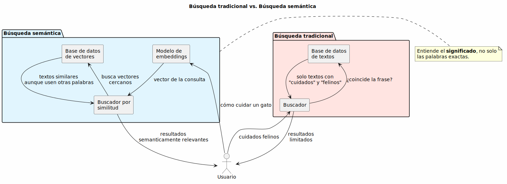
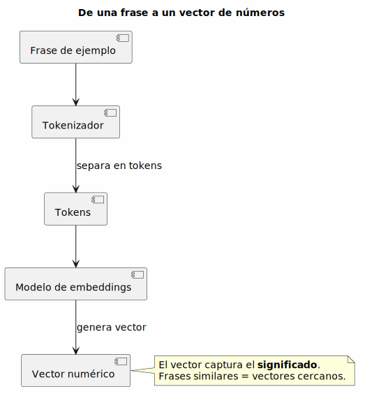
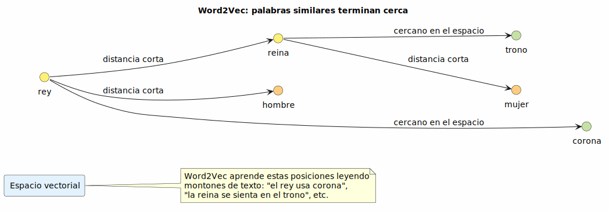
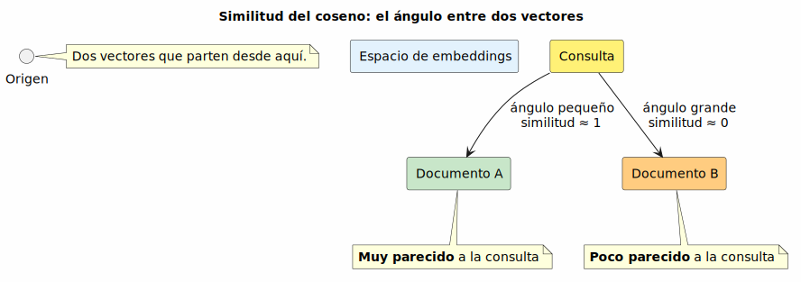
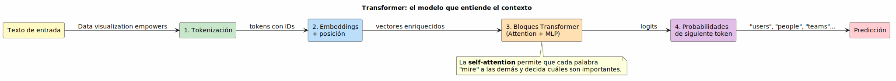
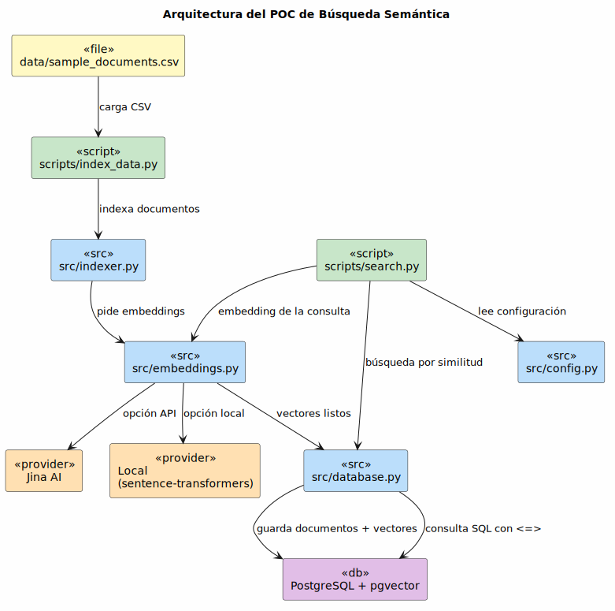
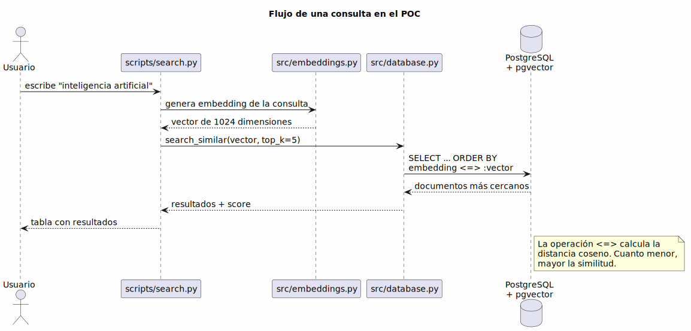

# 🔍 Búsqueda Semántica: ¿cómo hace Google para entender lo que buscamos?

> **De las palabras clave al significado, paso a paso y sin tecnicismos**

---

## 🎯 ¿De qué vamos a hablar hoy?

Vamos a entender cómo funciona una **búsqueda semántica** sin morir en el intento.

Partimos de una pregunta sencilla: ¿por qué a veces Google (o ChatGPT) te entiende aunque no uses las palabras exactas? Por ejemplo, si buscas "cómo cuidar un gato", también te muestra resultados de "cuidados felinos" o "higiene de los mininos", aunque no hayas escrito esas palabras.

Eso es la **búsqueda semántica**: no busca coincidencias de texto, busca **significado**.

Para entenderlo vamos a ver 4 conceptos, de lo más simple a lo más moderno:

1. **Tokens**: cómo la computadora "parte" el texto.
2. **Embeddings**: cómo convierte esas partes en números que capturan significado.
3. **Word2Vec**: la técnica de Google que popularizó todo esto.
4. **Transformers**: la arquitectura detrás de GPT, Llama, Gemini y demás.

Y al final veremos nuestro **POC** (Proof of Concept) hecho en Python, que hace búsqueda semántica sobre un dataset de 52 documentos usando PostgreSQL + pgvector.

---

## 1️⃣ ¿Por qué no basta con buscar palabras exactas?

Imagina que tienes una biblioteca y le pides al bibliotecario: "¿Tienes libros sobre cuidados felinos?". Un bibliotecario tonto solo buscaría libros cuyo título **literal** diga "cuidados felinos". Un bibliotecario inteligente entendería que también te sirven libros de "gatos", "mascotas", "higiene felina", etc.

La búsqueda tradicional es como el bibliotecario tonto. La búsqueda semántica es como el inteligente.



> **Dato clave**: la búsqueda semántica no necesita que la palabra exacta esté en el documento. Solo necesita que el **significado** sea similar.

---

## 2️⃣ Tokens: el texto no se lee palabra por palabra

Antes de entender el significado, el modelo tiene que romper el texto en pedacitos. A esos pedacitos se les llama **tokens**.

Un token puede ser:

- Una palabra completa (`casa`, `perro`).
- Parte de una palabra (`inteligencia` puede ser un token, o puede partirse en `intel` + `igencia` dependiendo del modelo).
- Un signo de puntuación.

### 🎮 Demo en vivo

Entra a **https://platform.openai.com/tokenizer** y prueba estas frases:

- `inteligencia artificial`
- `PostgreSQL`
- `búsqueda semántica`

Verás que el modelo no lee "inteligencia artificial" como dos palabras perfectas, sino que las parte según lo que aprendió durante su entrenamiento.

### 💡 Regla práctica

> En inglés, 1 token ≈ 4 caracteres o ¾ de una palabra. En español es parecido, pero varía un poco. Así que 100 tokens son más o menos 75 palabras.

Esto es importante porque muchos modelos cobran o limitan por cantidad de tokens. Pero para entender búsqueda semántica, lo importante es saber que **el modelo trabaja con tokens, no con palabras exactas**.

---

## 3️⃣ Embeddings: convertir significado en números

Aquí viene el truco mágico.

Un **embedding** es una lista de números (un vector) que representa el significado de una palabra, una frase o incluso un documento completo.

La idea es que:

- Textos con significado similar → vectores cercanos.
- Textos con significado distinto → vectores lejanos.



### 🗺️ Analogía: el mapa de palabras

Imagina que cada palabra es una ciudad en un mapa gigante. Las ciudades de palabras similares quedan cerca:

- `rey` queda cerca de `reina`.
- `gato` queda cerca de `felino`.
- `coche` queda lejos de `sandía`.

En la vida real esos vectores no tienen 2 o 3 dimensiones, sino **cientos o miles**. No podemos visualizarlos directamente, pero sí podemos proyectarlos a 2D o 3D.

### 🎮 Demos en vivo

1. **https://projector.tensorflow.org/**  
   Visualiza miles de palabras en 3D. Acércate, gira el espacio y verás que palabras similares forman grupitos (clusters).

2. **https://vectors.nlpl.eu/explore/embeddings/en/#**  
   Escribe una palabra en inglés, por ejemplo `king`, y te muestra sus 10 vecinos semánticos más cercanos (`queen`, `prince`, `royal`, etc.).

> **Frase para llevarse**: un embedding es una "huella numérica" del significado de un texto.

---

## 4️⃣ Word2Vec: el abuelo de los embeddings

**Word2Vec** es una técnica creada por Google en 2013 (por Tomas Mikolov y su equipo). Fue de las primeras en lograr que las computadoras entendieran relaciones entre palabras de forma automática.

### ¿Cómo aprende Word2Vec?

Con una idea muy simple pero poderosa: **"dime con quién te juntas y te diré quién eres"**.

El modelo lee montones de texto y aprende que palabras suelen aparecer cerca de otras. Si siempre ve frases como:

- "el **rey** lleva una **corona**"
- "la **reina** se sienta en el **trono**"
- "el **hombre** y la **mujer**"

Entonces termina poniendo los vectores de esas palabras cerca en el espacio.



### 🤯 El famoso ejemplo: `rey - hombre + mujer ≈ reina`

Si restas el vector de `hombre` al vector de `rey` y le sumas el vector de `mujer`, el resultado es muy parecido al vector de `reina`.

Es como si el espacio vectorial tuviera direcciones de significado:

- Una dirección para "género".
- Otra dirección para "monarquía".
- Otra para "países" vs "capitales".

### ⚠️ Limitación de Word2Vec

Word2Vec asigna **un solo vector por palabra**. Eso significa que no distingue contextos:

- "Banco" de sentarse y "banco" de dinero tienen el mismo vector.
- "apple" la fruta y "Apple" la empresa también.

Para eso necesitamos algo más moderno: los **Transformers**.

---

## 5️⃣ Similitud del coseno: ¿qué tan parecidos son dos vectores?

Ya tenemos textos convertidos en vectores. Ahora la pregunta es: **¿cómo sabemos si dos vectores son similares?**

La respuesta más usada en búsqueda semántica es la **similitud del coseno**.

### 🧭 La analogía de las flechas

Imagina que cada vector es una flecha que parte desde el mismo punto (el origen). Dos flechas pueden apuntar en direcciones muy parecidas o en direcciones muy distintas.

- Si apuntan **casi en la misma dirección** → el ángulo entre ellas es pequeño → son **muy similares**.
- Si apuntan en **direcciones muy distintas** → el ángulo entre ellas es grande → son **poco similares**.

La similitud del coseno mide justamente eso: el **coseno del ángulo** entre los dos vectores.



### 📏 Cómo se lee el resultado

| Similitud del coseno | Significado |
|---------------------:|-------------|
| **1.0** | Vectores idénticos (apuntan exactamente a la misma dirección) |
| **0.8 - 0.99** | Muy parecidos |
| **0.5 - 0.8** | Algo parecidos |
| **0.0** | No tienen relación (ángulo de 90°) |
| **-1.0** | Opuestos totalmente (en búsqueda semántica rara vez vemos esto) |

### 💡 ¿Por qué usamos coseno y no distancia "recta"?

Porque lo que nos importa es la **dirección**, no el tamaño.

Imagina dos frases:

- "El gato duerme".
- "El pequeño gato duerme profundamente en su cama".

La segunda frase es más larga, así que su vector probablemente tendrá números más grandes. Pero la **dirección** del vector sigue siendo muy parecida a la primera porque hablan de lo mismo: un gato durmiendo.

La similitud del coseno ignora el tamaño y se fija solo en la dirección. Eso la hace ideal para comparar significados.

### 🔍 ¿Dónde se usa en nuestro POC?

En el proyecto, `pgvector` calcula la distancia coseno con el operador `<=>`. Luego el código convierte esa distancia en un score de similitud:

```
similitud = 1 - distancia_coseno
```

Por eso en los resultados de búsqueda ves scores como **0.89**, **0.84**, etc. Cuanto más cercano a 1, más relevante es el documento para tu consulta.

> **Frase para llevarse**: la similitud del coseno nos dice si dos textos "apuntan en la misma dirección" de significado.

---

## 6️⃣ Transformers: la revolución que entiende el contexto

Los **Transformers** son la arquitectura que usan modelos como GPT, Llama, Gemini, BERT, T5, etc.

Fueron presentados en el paper "Attention Is All You Need" en 2017 y cambiaron todo.

### ¿Qué hace especial a un Transformer?

Antes, los modelos leían texto palabra por palabra, como nosotros cuando leemos un libro. Los Transformers, en cambio, **leen toda la frase al mismo tiempo** y se preguntan:

> "¿Qué palabras son importantes para entender esta otra palabra?"

Eso se llama **self-attention** (atención sobre sí mismo).

### 🧱 Un modelo no tiene un solo Transformer, tiene muchos apilados

Aquí hay un punto que suele confundir: cuando hablamos de "un Transformer", en realidad nos referimos a un **bloque** que hace self-attention y luego pasa los datos por una red neuronal (MLP). Los modelos grandes **apilan muchos de estos bloques uno tras otro**.

Es como si cada bloque fuera un lector que revisa el texto y le agrega un poco más de entendimiento:

| Modelo | Bloques Transformer | Parámetros totales |
|--------|--------------------:|-------------------:|
| GPT-2 small | **12** | 124 millones |
| GPT-3 | **96** | 175 mil millones |
| GPT-4 | aún más | se estima ~1.8 billones |
| Jina embeddings v3 (usado en este POC) | varios bloques | 570 millones |

> **Frase clave**: cada bloque Transformer toma la representación de los tokens, les aplica atención y las refiniza. El siguiente bloque recibe ese refinamiento y lo mejora aún más. Al final, después de pasar por docenas de bloques, el modelo tiene una comprensión muy rica del texto.

Por eso un modelo como GPT-2 small es capaz de entender contexto: no es magia, son **12 bloques Transformer trabajando en cadena**.

### 🎮 Demo en vivo

Entra a **https://poloclub.github.io/transformer-explainer/** y juega con el ejemplo.

Allí podrás ver paso a paso:

1. **Tokenización**: cómo se parte el texto.
2. **Embeddings + posición**: cada token se convierte en un vector y se le agrega información de su posición en la frase.
3. **Self-attention**: cómo cada palabra "mira" a las demás. La analogía clásica es la de buscar en Google:
   - **Query (Q)**: lo que tú escribes en la barra de búsqueda.
   - **Key (K)**: los títulos de los resultados.
   - **Value (V)**: el contenido real de las páginas.
4. **Predicción del siguiente token**: el modelo adivina cuál es la palabra más probable que sigue.



### 💡 Por qué esto importa para búsqueda semántica

Gracias a los Transformers, un embedding ya no es solo de una palabra aislada. Es de una palabra **en su contexto**.

- "El banco estaba lleno" → `banco` significa "asiento".
- "Fui al banco a sacar plata" → `banco` significa "institución financiera".

Aunque la palabra sea la misma, el vector cambia según el contexto. Eso hace que la búsqueda semántica sea mucho más precisa.

---

## 7️⃣ Nuestro POC: Búsqueda Semántica con Python

Ahora que entendemos los conceptos, veamos cómo funciona el proyecto que tenemos en este repositorio.

### Stack tecnológico

| Capa | Tecnología |
|------|------------|
| Lenguaje | Python 3.10+ |
| Base de datos | PostgreSQL 15 + extensión `pgvector` |
| ORM | SQLAlchemy 2.x |
| Embeddings (API) | Jina AI (`jina-embeddings-v3`, 1024 dimensiones) |
| Embeddings (local) | `sentence-transformers` (MiniLM, 384 dimensiones) |
| CLI | Rich |
| Contenedores | Docker Compose |



### Flujo de indexación

1. `index_data.py` lee el CSV (`data/sample_documents.csv`).
2. `src/indexer.py` pide los embeddings a `src/embeddings.py`.
3. `src/embeddings.py` usa Jina AI o el modelo local.
4. `src/database.py` guarda cada documento con su vector en PostgreSQL.

### Flujo de búsqueda



1. El usuario escribe una consulta en la CLI (`scripts/search.py`).
2. Se genera el embedding de la consulta con el mismo modelo.
3. PostgreSQL + pgvector busca los vectores más cercanos usando distancia coseno (`<=>`).
4. Se muestran los resultados ordenados por score de similitud.

> **Truco**: como usamos el **mismo modelo** para indexar y para consultar, los vectores viven en el mismo "mapa de significados".

---

## 🚀 Demo

Si quieres mostrarlo en vivo, estos son los comandos:

```bash
# 1. Levantar la base de datos
docker compose up -d

# 2. Inicializar tablas e índices
python scripts/init_db.py

# 3. Indexar el dataset de ejemplo
python scripts/index_data.py --file data/sample_documents.csv

# 4. Abrir la CLI de búsqueda
./venv/bin/python scripts/search.py
```

### 🔍 Trozos de código clave

Si quieres mostrar qué pasa "por debajo", estos son los pedazos más importantes del código.

#### 1. Conexión a Jina AI para obtener los embeddings

En `src/embeddings.py`, el `JinaEmbeddingsClient` arma el payload y llama a la API:

```python
url = f"{self.base_url}/embeddings"
payload = {
    "model": self.model,
    "input": texts,
}

with httpx.Client(timeout=60.0, verify=False) as client:
    response = client.post(url, headers=self.headers, json=payload)
    response.raise_for_status()
    data = response.json()

embeddings = sorted(data["data"], key=lambda x: x["index"])
return [item["embedding"] for item in embeddings]
```

> **Lo que hace**: le envía los textos a Jina AI y recibe una lista de vectores (las "coordenadas" de cada texto).

#### 2. Definición de la tabla con el vector

En `src/database.py`, el modelo `Document` indica que cada fila guarda un vector:

```python
class Document(Base):
    __tablename__ = "documents"

    id = Column(Integer, primary_key=True, autoincrement=True)
    content = Column(Text, nullable=False)
    metadata_ = Column("metadata", JSON, nullable=True)
    embedding = Column(Vector(settings.embedding_dimension))
```

> **Lo que hace**: crea la tabla `documents` con las columnas `id`, `content`, `metadata` y `embedding`, donde `embedding` es del tipo `VECTOR(1024)` o `VECTOR(384)` según el modelo.

#### 3. Guardar documentos con sus vectores

También en `src/database.py`, `add_documents_bulk` inserta todo junto:

```python
def add_documents_bulk(self, documents: List[dict]):
    session = self.SessionLocal()
    try:
        docs = [
            Document(
                content=d["content"],
                embedding=d["embedding"],
                metadata_=d.get("metadata"),
            )
            for d in documents
        ]
        session.add_all(docs)
        session.commit()
```

> **Lo que hace**: toma una lista de documentos ya con sus embeddings y los guarda en PostgreSQL en una sola transacción.

#### 4. Búsqueda por similitud coseno

La consulta SQL que hace la magia está en `search_similar`:

```python
sql = text(
    """
    SELECT
        id,
        content,
        metadata,
        1 - (embedding <=> :embedding) AS similarity_score
    FROM documents
    ORDER BY embedding <=> :embedding
    LIMIT :top_k
    """
)
```

> **Lo que hace**: `embedding <=> :embedding` calcula la distancia coseno entre el vector de la consulta y los vectores guardados. `1 - distancia` nos da el score de similitud. `ORDER BY` y `LIMIT` traen los más parecidos.

Luego prueba estas consultas en la CLI:

| Consulta | Resultado esperado |
|----------|-------------------|
| `inteligencia artificial` | Machine learning, redes neuronales, IA generativa |
| `arte moderno` | Cubismo, impresionismo, surrealismo |
| `guerras del siglo XX` | Segunda Guerra Mundial, Guerra Fría, Revolución Rusa |
| `tecnología de contenedores` | Docker, Kubernetes, nube |

La magia está en que si buscas "máquinas que aprenden solas", probablemente también te salgan resultados sobre machine learning, aunque no hayas escrito esa palabra exacta.

---

## 🧠 Resumen: el camino que recorrimos

```
Texto humano
    ↓
Tokens (pedacitos)
    ↓
Embeddings (números con significado)
    ↓
Word2Vec (el pionero de Google)
    ↓
Similitud del coseno (comparar vectores)
    ↓
Transformers (contexto + atención)
    ↓
Búsqueda semántica (encontrar lo similar aunque no sea igual)
```

---

## 📚 Recursos para profundizar

- **Tokenizer de OpenAI**: https://platform.openai.com/tokenizer
- **Visualizador 3D de embeddings (TensorFlow)**: https://projector.tensorflow.org/
- **Vecinos semánticos de palabras**: https://vectors.nlpl.eu/explore/embeddings/en/#
- **Explorador visual de Transformers**: https://poloclub.github.io/transformer-explainer/
- **README de este proyecto**: [`README.md`](README.md)

---

## ❓ Preguntas frecuentes para cerrar

**¿Por qué usamos PostgreSQL y no solo guardar los vectores en memoria?**  
Porque pgvector permite buscar por similitud directamente en SQL, con índices y todo. Es escalable.

**¿Por qué el modelo genera vectores de 1024 o 384 dimensiones?**  
Es una propiedad del modelo. Jina usa 1024, MiniLM usa 384. Lo importante es que la base de datos esté configurada con la dimensión correcta.

**¿Puedo usar esto para buscar en mis propios documentos?**  
Sí. Solo reemplaza `data/sample_documents.csv` por tu CSV con una columna llamada `content`.

---

> **Nota final**: la búsqueda semántica no es magia, es matemática aplicada al lenguaje. Pero el resultado parece mágico cuando encuentra exactamente lo que querías, aunque no supieras cómo preguntarlo. ✨
